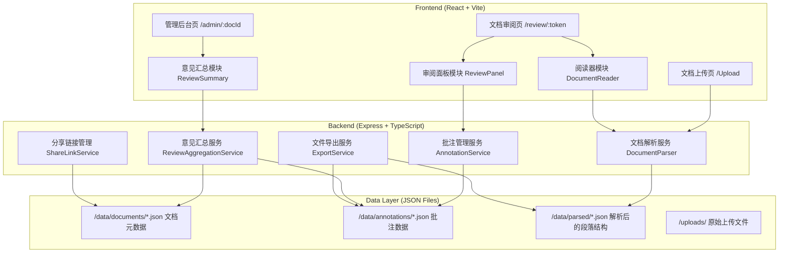
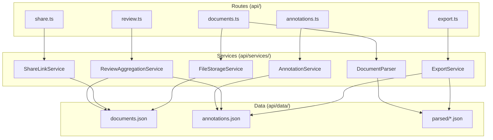
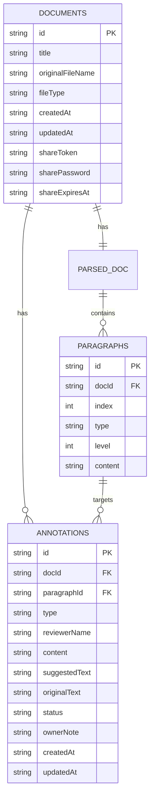

## 1. 架构设计



## 2. 技术描述

- **前端**：React@18 + TypeScript + Vite + Tailwind CSS@3 + Zustand + React Router DOM
- **初始化工具**：vite-init（react-express-ts 模板）
- **后端**：Express@4 + TypeScript（ESM 模式）
- **数据存储**：本地 JSON 文件（无需数据库，内网轻量部署）
- **文档解析**：
  - Markdown：`marked` 或 `markdown-it` 解析，自定义规则拆分为段落
  - Word(.docx)：`mammoth` 解析为 HTML，再转换为结构化段落
- **前端 Markdown 渲染**：`react-markdown` + `remark-gfm`

## 3. 路由定义

### 前端路由

| 路由 | 用途 |
|-------|---------|
| `/` | 文档上传页 + 文档列表 |
| `/review/:token` | 文档审阅页（公开分享链接） |
| `/admin/:docId` | 管理后台页（审阅意见汇总与处理） |

### 后端 API 路由

| 方法 | 路由 | 用途 |
|-------|-------|---------|
| POST | `/api/documents/upload` | 上传文档（multipart/form-data） |
| GET | `/api/documents` | 获取文档列表 |
| GET | `/api/documents/:id` | 获取文档详情（元数据） |
| DELETE | `/api/documents/:id` | 删除文档 |
| GET | `/api/documents/:id/parsed` | 获取解析后的段落结构 |
| POST | `/api/documents/:id/share` | 生成/重新生成分享链接 |
| GET | `/api/share/:token` | 通过分享 token 获取文档信息（用于审阅页） |
| GET | `/api/share/:token/parsed` | 通过分享 token 获取解析后文档 |
| POST | `/api/annotations` | 添加批注 |
| GET | `/api/annotations/:docId` | 获取文档所有批注 |
| PATCH | `/api/annotations/:id/status` | 更新批注状态（accepted/rejected/pending） |
| DELETE | `/api/annotations/:id` | 删除批注 |
| GET | `/api/review/:docId/summary` | 获取审阅汇总统计 |
| GET | `/api/export/:docId` | 导出合并后文档（Markdown 格式） |

## 4. API 类型定义

```typescript
// 共享类型定义

interface DocumentMeta {
  id: string;
  title: string;
  originalFileName: string;
  fileType: 'markdown' | 'docx';
  createdAt: string;
  updatedAt: string;
  shareToken?: string;
  sharePassword?: string;
  shareExpiresAt?: string;
  annotationCount: number;
  reviewerCount: number;
}

interface Paragraph {
  id: string;
  index: number;
  type: 'heading' | 'paragraph' | 'list' | 'code' | 'quote' | 'table';
  level?: number; // heading level 1-6
  content: string; // markdown or plain text
  rawHtml?: string;
}

interface ParsedDocument {
  docId: string;
  paragraphs: Paragraph[];
}

type AnnotationType = 'comment' | 'suggestion';
type AnnotationStatus = 'pending' | 'accepted' | 'rejected';

interface Annotation {
  id: string;
  docId: string;
  paragraphId: string;
  type: AnnotationType;
  reviewerName: string;
  reviewerEmail?: string;
  content: string; // 批注内容
  suggestedText?: string; // 建议修改后的文本（type=suggestion 时必填）
  originalText?: string; // 选中的原文片段
  status: AnnotationStatus;
  ownerNote?: string; // 文档所有者备注
  createdAt: string;
  updatedAt: string;
}

interface ReviewSummary {
  docId: string;
  totalAnnotations: number;
  pendingCount: number;
  acceptedCount: number;
  rejectedCount: number;
  commentCount: number;
  suggestionCount: number;
  byReviewer: { name: string; count: number }[];
  byParagraph: { paragraphId: string; count: number }[];
}
```

## 5. 后端服务架构



## 6. 数据模型

### 6.1 数据结构关系



### 6.2 JSON 文件格式

**documents.json**（数组形式存储所有文档元数据）：
```json
[
  {
    "id": "doc_abc123",
    "title": "产品需求文档",
    "originalFileName": "prd.docx",
    "fileType": "docx",
    "createdAt": "2026-06-11T08:00:00.000Z",
    "updatedAt": "2026-06-11T08:00:00.000Z",
    "shareToken": "share_xyz789",
    "sharePassword": null,
    "shareExpiresAt": null
  }
]
```

**annotations/doc_abc123.json**（按文档 ID 分文件存储）：
```json
[
  {
    "id": "ann_001",
    "docId": "doc_abc123",
    "paragraphId": "p_003",
    "type": "suggestion",
    "reviewerName": "张三",
    "content": "这里的数据口径需要明确",
    "suggestedText": "根据上月财务报表（口径：不含税）",
    "originalText": "根据上月报表",
    "status": "pending",
    "ownerNote": null,
    "createdAt": "2026-06-11T09:00:00.000Z",
    "updatedAt": "2026-06-11T09:00:00.000Z"
  }
]
```

**parsed/doc_abc123.json**（解析后的段落结构）：
```json
{
  "docId": "doc_abc123",
  "paragraphs": [
    {
      "id": "p_001",
      "index": 0,
      "type": "heading",
      "level": 1,
      "content": "产品需求文档"
    },
    {
      "id": "p_002",
      "index": 1,
      "type": "paragraph",
      "content": "本文档描述了产品的核心需求..."
    }
  ]
}
```

### 6.3 项目目录结构

```
/
├── src/                          # 前端源码
│   ├── components/
│   │   ├── DocumentReader.tsx    # 文档阅读器组件
│   │   ├── ReviewPanel.tsx       # 审阅面板组件
│   │   ├── AnnotationCard.tsx    # 批注卡片组件
│   │   ├── SummaryStats.tsx      # 汇总统计组件
│   │   ├── FileUpload.tsx        # 文件上传组件
│   │   └── DocumentList.tsx      # 文档列表组件
│   ├── pages/
│   │   ├── UploadPage.tsx        # 上传页
│   │   ├── ReviewPage.tsx        # 审阅页
│   │   └── AdminPage.tsx         # 管理后台页
│   ├── hooks/
│   │   ├── useDocument.ts
│   │   └── useAnnotations.ts
│   ├── store/
│   │   └── reviewStore.ts        # Zustand 状态管理
│   ├── utils/
│   │   └── api.ts                # API 请求封装
│   ├── types/
│   │   └── index.ts              # 共享类型定义
│   ├── App.tsx
│   └── main.tsx
├── api/                          # 后端源码
│   ├── index.ts                  # Express 入口
│   ├── routes/
│   │   ├── documents.ts
│   │   ├── share.ts
│   │   ├── annotations.ts
│   │   ├── review.ts
│   │   └── export.ts
│   ├── services/
│   │   ├── DocumentParser.ts     # 文档解析服务
│   │   ├── AnnotationService.ts  # 批注管理服务
│   │   ├── ReviewAggregationService.ts
│   │   ├── ShareLinkService.ts
│   │   ├── ExportService.ts
│   │   └── FileStorageService.ts # JSON 文件读写
│   ├── middleware/
│   │   └── errorHandler.ts
│   └── types/
│       └── index.ts
├── shared/
│   └── types.ts                  # 前后端共享类型
├── data/                         # JSON 数据存储
│   ├── documents.json
│   ├── annotations/
│   └── parsed/
├── uploads/                      # 原始上传文件
└── public/                       # 静态资源
```
